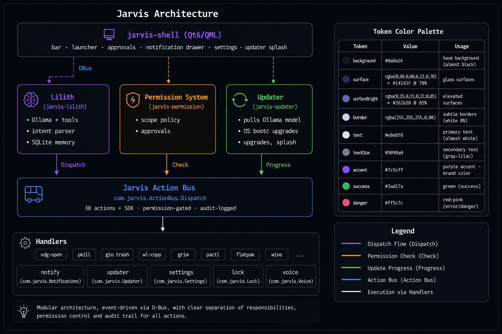

# LilithOS

> An AI-native desktop operating system. Lilith lives in the bar at the bottom of every screen, system actions flow through a single typed orchestration layer, and "open the browser to my dashboard" is a primitive — not a fragile script.

   

---

## What this is

LilithOS treats AI as a **native operating-system component**, not a chatbot bolted on top of Linux. Everything the AI can do, you can do — and vice-versa — because both sides go through the same typed API.

- **Lilith** — local AI assistant (Ollama + `qwen3:1.7b` by default), always present in the bar. Multi-turn conversation, multi-step tool chaining, streaming responses, rule-based fast path for common phrases. Never speaks to the system except through actions.
- **Action Bus** — single DBus service every effect flows through. 38 built-in actions across `app.*`, `file.*`, `window.*`, `browser.*`, `clipboard.*`, `screenshot.*`, `audio.*`, `system.*`, `updater.*`, `compat.*`, plus any action registered by an SDK app at startup. Each call is permission-checked, dispatched to a real handler, and audit-logged.
- **Permission System** — OS-level approval dialogs for dangerous scopes. `clipboard.read` and `screen.read` prompt the user the first time Lilith asks; the user can approve once or always.
- **Updater** — first-boot "Windows-Update style" splash that pulls Lilith's model from Ollama so the ISO stays slim (no 2.5 GB of weights baked in). OS upgrades via `bootc` plug in on the same surface.
- **Voice** — Whisper.cpp STT + Piper TTS + sliding-window Whisper hotword for "oi lilith" + MFCC+DTW voiceprint matcher. Per-user daemon under a cpal actor (audio device is `!Send`). All local, audio never leaves the device.
- **Notifications** — owns `org.freedesktop.Notifications`, persists history to SQLite, honours action buttons. Drawer in the shell shows recent + per-row dismiss + clear-all.
- **Compat** — `com.jarvis.Compat` runs `.exe`s through Wine (per-app prefixes under `~/.jarvis/wine/`) or Proton-GE (per-app under `~/.jarvis/proton-data/`). Live tracking of running children, dispatchable terminate, on-demand Proton-GE install with progress notifications.
- **Greeter** — custom greetd UI with a three-mode SwipeView (Standard / Lilith / Focus). Visually continuous with the lock screen and the shell.
- **Lock** — `com.jarvis.Lock` overlay via wlr-layer-shell; dual PAM stack (password instant, voice on dedicated button); idle auto-lock via swayidle with configurable timeout; `Super+L` everywhere.
- **pam_jarvis.so** — custom PAM module wired into `/etc/pam.d/jarvis-lock` for biometric voice unlock. Shells out to a tiny helper that calls the voice daemon via session bus.
- **Shell** — Qt 6 / QML, bar anchored to the bottom of every output via `wlr-layer-shell`. Launcher (with Flatpak discovery), approvals, notification drawer, settings panel (model / TTS / hotword / voice enrollment / idle lock), updater splash, glassmorphism via Qt MultiEffect.

## What this is not

These are explicit non-goals listed in [`.jarvis/jarvis-core-context.md`](./.jarvis/jarvis-core-context.md):

- Not a Windows clone.
- Not another Linux skin.
- Not a telemetry-driven surveillance platform.
- Not enterprise architecture theater in a desktop shell.
- **Not a chatbot that happens to have a desktop.**
- Not a research project that never ships.

If the answer to "what stops someone from doing this in an afternoon with `dnf install gnome-shell-extension-blur-my-shell && flatpak install Alpaca`?" is "nothing", that's the wrong design — and we've actively rejected it.

## Architecture



Pre-session: **greetd** spawns [`shell/jarvis-greeter/`](./shell/jarvis-greeter/module.md) (Qt overlay under `cage`). Post-login: the **labwc** compositor brings up the shell, the per-user daemons (voice, notifications, compat, lock), and Lilith. The custom Smithay-based `jarvis-compositor` is parked as a Phase 4 placeholder in [`shell/compositor/`](./shell/compositor/module.md).

## Status

Phases 1–10 closed. Phase 11 candidates documented in [current-goals](./.jarvis/contexts/current-goals.md).

| Phase | What |
|---|---|
| **Phase 1 ✅** | Action Bus, Permission System, Lilith daemon, Qt shell with layer-shell bar, launcher, approval dialog, bootable Fedora-bootc ISO, first-boot updater. |
| **Phase 2 ✅** | Voice pipeline (Whisper STT + Piper TTS via cpal actor), Action Bus to 28 actions, OS-update flow, launcher focus restoration, settings panel. |
| **Phase 3 ✅** | Wine compat (V1+V2), Flatpak app install, Jarvis SDK + example apps, custom 3-mode greeter, lock screen V1, notifications V2. Plus polish round: launcher Flatpaks, drawer dismiss/clear, SDK example visible, idle auto-lock. |
| **Phase 4 ✅** | Anime avatar slot + procedural fallback (greeter Lilith mode), biometric PAM scaffold, Proton-GE compat path, Smithay compositor scaffold (opt-in build), glassmorphism V1 via Qt MultiEffect. |
| **Phase 5 ✅** | `compat.install_proton` with progress, idle auto-lock timeout configurable, notifications persisted to SQLite (V3), compat lifecycle tracking (list_running + terminate), voiceprint V2 scaffold (envelope matcher). |
| **Phase 6 ✅** | MFCC + DTW real voiceprint matcher, pam-jarvis V2 (helper binary + session bus call), hotword V2 (1.5s window + ZCR VAD). |
| **Phase 7 ✅** | `jarvis-voiceprint-ctl` CLI, SettingsPanel biometric section, first shipping PAM wiring for jarvis-lock. |
| **Phase 8 ✅** | Dual PAM stack (typed-password instant; voice opt-in), `Lock.VerifyVoice()` method, "🎙 Falar para desbloquear" pill in the lock window. |
| **Phase 9 ✅** | Lilith multi-turn conversation history, multi-step tool chaining (assistant ↔ tool ↔ assistant loop), Jarvis-OS-aware system prompt in pt-BR. |
| **Phase 10 ✅** | Lilith streaming responses via PartialReply signal, ChainStep signal exposes mid-chain state, shell renders running tool / streamed text in the input placeholder. |

Current ISO: ~4.3 GB, boots in VirtualBox, autologin → labwc → bar at the bottom, splash → model pull → Lilith answers. From the greeter you also reach `Super+L` (lock), `notify-send` (toasts in our style), and `compat.run_exe` (Wine).

## Try it

The simplest path is to grab a build artifact from a GitHub Actions run on the [`main` branch](https://github.com/H4x0rModdz/jarvis-os/actions/workflows/build-iso.yml) and boot it in a VM (VirtualBox, qemu, libvirt — anything that boots a UEFI ISO).

```text
# In your VM:
# - 4 GB RAM, 25 GB disk, UEFI firmware
# - boot from jarvis-os-<version>.iso
# - Anaconda installer; pick the disk; Begin Installation
# - reboot, the greeter appears (Standard / Lilith / Focus modes)
# - log in as `jarvis`, watch the updater splash
# - bar appears, type something into the Lilith input
```

Anything else you'd normally do on a Fedora Atomic system works too (it *is* one).

## Build

End-to-end ISO build via Containerfile + bootc-image-builder:

```bash
# Inside the repo root
bash tools/build-iso.sh
# Output: iso/output/bootiso/install.iso
```

Requirements: podman 4.5+, ~10 GB free disk, internet access for `fedora-bootc:42` + Rust crates + Ollama installer + Flathub remote.

Per-crate development on Linux (WSL2 works):

```bash
cargo test --workspace --exclude jarvis-compositor
# All daemons compile + their unit tests pass.

cmake -S shell/jarvis-shell -B /tmp/shell-build
cmake --build /tmp/shell-build -j
# Qt 6.5+ required — Theme singleton breaks under the Qt 6.4 compat
# mode. On Ubuntu 24.04 install Qt 6.8 via aqtinstall; see
# tools/dev/run-shell-labwc.sh.
```

## Repository layout

```
.
├── ai/lilith/                  # AI assistant daemon (Rust)
├── system/
│   ├── action-bus/             # central orchestration DBus daemon (Rust)
│   ├── permission/             # scope policy + approval flow (Rust)
│   ├── updater/                # first-boot asset puller + bootc upgrades (Rust)
│   ├── settings/               # com.jarvis.Settings, SQLite-backed (Rust)
│   ├── voice/                  # com.jarvis.Voice, Whisper + Piper + cpal (Rust)
│   ├── notifications/          # org.freedesktop.Notifications server, SQLite history (Rust)
│   ├── compat/                 # com.jarvis.Compat, Wine + Proton-GE prefix runner (Rust)
│   ├── lock/                   # com.jarvis.Lock, session lock daemon (Rust)
│   └── pam-jarvis/             # pam_jarvis.so + jarvis-pam-helper for biometric auth (Rust)
├── shell/
│   ├── jarvis-shell/           # bar / launcher / dialogs / drawer (Qt 6 / QML)
│   ├── jarvis-greeter/         # custom greetd UI, 3-mode SwipeView, anime-avatar slot (Qt 6 / QML)
│   ├── jarvis-lock/            # full-screen lock overlay with voice-unlock pill (Qt 6 / QML)
│   └── compositor/             # Smithay scaffold; opt-in build (BUILD_COMPOSITOR=1)
├── sdk/
│   ├── jarvis-sdk-types/       # action manifest schema (shared crate)
│   └── jarvis-sdk-rust/        # thin DBus helper for SDK app authors
├── examples/
│   └── jarvis-app-hello/       # minimal SDK app — registers one action
├── tools/
│   ├── build-iso.sh            # entry point
│   ├── lock-ctl/               # Super+L → com.jarvis.Lock.Lock()
│   ├── voice-ctl/              # CLI for com.jarvis.Voice (push-to-talk, TTS)
│   ├── voiceprint-ctl/         # CLI for voiceprint enroll / verify / list / delete
│   ├── jarvis-app/             # SDK app launcher / dispatcher
│   └── dev/                    # run-shell-labwc.sh, ad-hoc helpers
├── iso/                        # Containerfile + assets + build.toml
└── .jarvis/                    # project bible, ADRs, module contracts,
                                # skills, design language, current goals
```

Every module has a `module.md` documenting its boundaries, interface, and failure modes — read those before the source. The `.jarvis/` tree is the canonical context for both human contributors and AI agents.

## License

LilithOS is licensed under the **GNU General Public License v3.0** — see
[`LICENSE`](./LICENSE). In short: you can use, study, share and modify it (and
even sell it), but any version you **distribute** must stay open under the same
license.

**No warranty.** LilithOS is provided "as is", without warranty of any kind, to
the extent permitted by law (GPL-3.0 §15–16). It is pre-1.0 software that runs
system actions through an AI assistant — use it at your own risk.

**Third-party components.** The OS image bundles independent programs under
their own licenses (Fedora base, Qt/LGPL, Wine/LGPL, mpv & WhiteSur/GPL, Zed,
Firefox/MPL, Ollama, whisper.cpp, piper, …). LilithOS ships them unmodified;
their source is available from their upstreams (and from Fedora/Flathub for the
packaged builds). See each component's own license for its terms.

## Contributing

Want to build the AI-native desktop with us? Start with
[`CONTRIBUTING.md`](./CONTRIBUTING.md) — branch/PR flow, the ground rules
(every module gets a `module.md`, all actions go through the Action Bus, …),
and the ADR process for architecture decisions. `main` is protected; changes
land via PR with green CI.

## Pointers

- Architecture and rationale: [`.jarvis/jarvis-core-context.md`](./.jarvis/jarvis-core-context.md)
- How to contribute: [`CONTRIBUTING.md`](./CONTRIBUTING.md)
- Decisions log: [`.jarvis/decisions/`](./.jarvis/decisions/)
- Current goals: [`.jarvis/contexts/current-goals.md`](./.jarvis/contexts/current-goals.md)
- Engineering rules (no `utils.rs`, no `helpers/`, etc.): [`.jarvis/skills/`](./.jarvis/skills/)
